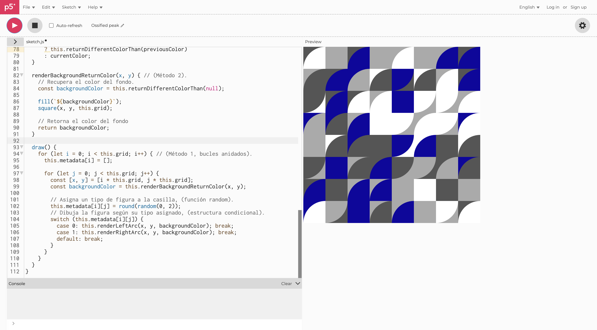
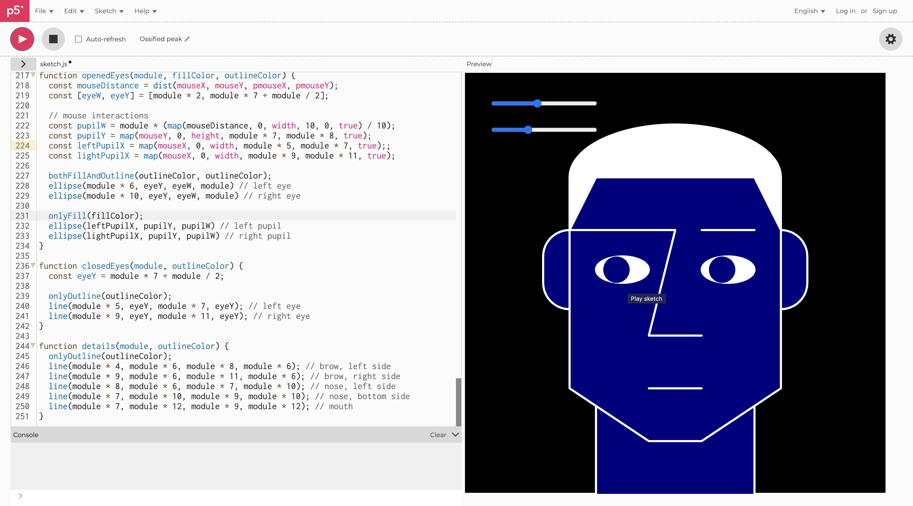
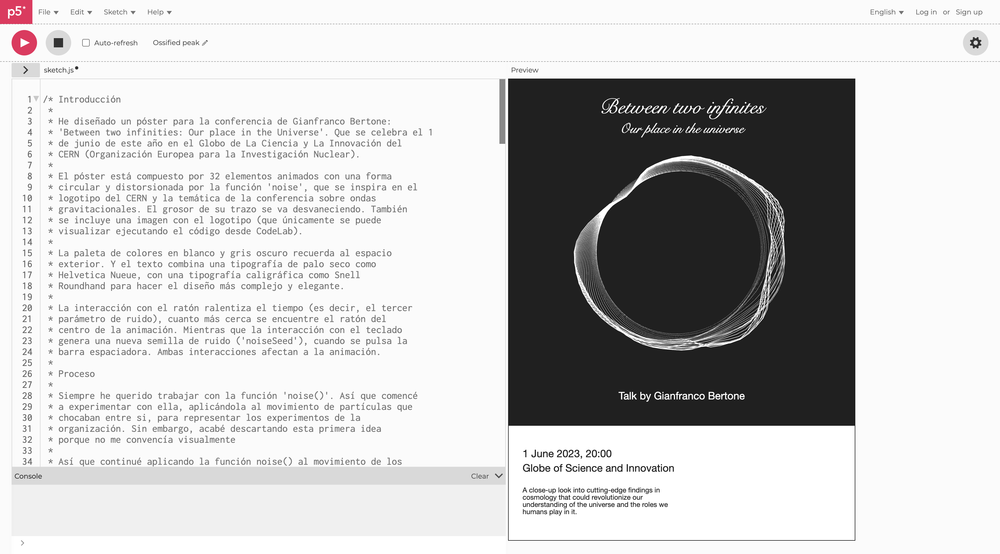
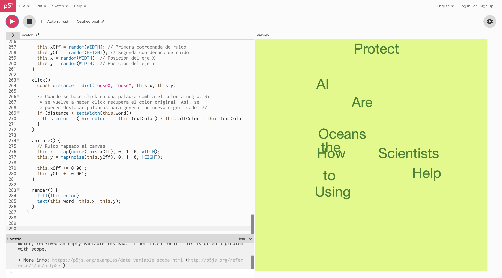

# Creative Coding

Generative art in p5.js from the 'Programming for The Arts' course within the Bachelor's Degree in Digital Design.

## Block 2, exercise 22

## Block 3, exercise 19

## Block 4, exercise 24

## Block 5, exercise 17

